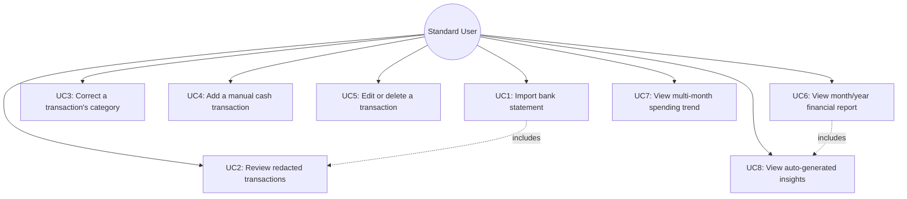
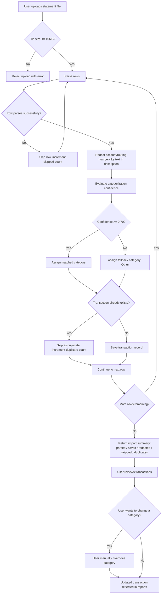

# KnowYourFinance — Software Requirements Specification (SRS)

**Milestone 2 — Requirements Specification**
**Course:** COMP 425, Software Engineering
**Standard followed:** ISO/IEC/IEEE 29148:2018 (structure and terminology)
**Status:** Draft for Milestone 2 submission

> **Scope note on this document:** This SRS describes the **problem space** —
> what the system must do, who it serves, and the constraints it must satisfy —
> not the solution space. No specific database, framework, programming
> language, or code structure is named anywhere below. Those are
> implementation decisions, documented separately in this repository's
> `docs/build-log/` entries, and are intentionally out of scope for this
> document.

---

## 1. Introduction & System Scope

### 1.1 Purpose

KnowYourFinance (KYF) is a personal budgeting and finance-tracking system
that lets a person understand what they earned, spent, and saved over any
chosen period, without requiring them to connect a live bank account or
surrender sensitive banking credentials to the system. The system's purpose
is to turn a person's existing bank statements and manually-entered cash
transactions into a categorized, queryable financial picture, while
actively protecting the sensitive identifiers (account numbers, routing
numbers) that a statement may contain.

### 1.2 Boundaries

The system is a single-user personal finance tool. It accepts transaction
data from two sources — an uploaded bank statement export, or direct manual
entry — and produces categorized transaction records and period-based
financial reports from that data. It does not initiate, authorize, or
process any real-world financial transaction; it is a read/record and
report system, not a payment or transfer system.

### 1.3 In-Scope (Minimum Viable Product)

| # | Capability |
|---|---|
| 1 | Importing a bank statement export and converting it into individual transaction records |
| 2 | Automatically detecting and removing account-number- and routing-number-like identifiers from imported statement text before that text is stored anywhere |
| 3 | Automatically assigning a spending category to each imported transaction, with a defined fallback for low-confidence cases |
| 4 | Manually recording a single transaction (for cash spending, or anything a statement wouldn't capture) |
| 5 | Viewing, editing, and deleting individual transaction records, including correcting an automatically-assigned category |
| 6 | Generating an income-vs-expense report for any user-selected month and year, broken down by spending category |
| 7 | Generating a multi-month spending trend view |
| 8 | Generating plain-language, auto-produced observations ("insights") about a selected period compared to the prior period |
| 9 | Preventing duplicate transactions from being created when the same statement is imported more than once |

### 1.4 Out-of-Scope (explicitly excluded from this MVP)

| # | Excluded capability | Rationale |
|---|---|---|
| 1 | Live bank account connection / credential-based linking to a financial institution | Core product decision — see Section 1.1; also removes an entire class of security and compliance risk from the MVP |
| 2 | Storage of real account numbers, routing numbers, or other bank-issued account identifiers, in any form, at any stage | Core privacy guarantee of the product |
| 3 | User authentication, account creation, or multi-user access control | Deferred to a later milestone; the MVP operates as a single implicit user |
| 4 | Budgets, spending goals, or alerting when a goal is exceeded | Deferred enhancement |
| 5 | Detection of recurring/subscription charges | Deferred enhancement |
| 6 | Export of reports to an external file format (PDF, spreadsheet, etc.) | Deferred enhancement |
| 7 | Support for statement formats other than a plain delimited text export (e.g., scanned/image statements) | Deferred enhancement; would require a different ingestion approach |
| 8 | Multi-currency support | Deferred enhancement |

---

## 2. User Roles

| Role | Description |
|---|---|
| **Standard User** | The primary and, for this MVP, only actor. A single person using the system to import statements, record transactions, correct categorization, and view reports about their own finances. All functional requirements in Section 3 are written from this role's perspective unless stated otherwise. |
| **System Administrator** *(out of scope for MVP)* | A future role responsible for operating the system itself (e.g., monitoring, configuration). No administrative functions are implemented or required in this milestone; listed here only to document the boundary explicitly, per Section 1.4. |

---

## 3. Functional Requirements (FRs)

Each requirement uses the mandatory keyword **shall** and carries a unique,
persistent identifier. Requirements are grouped into logical modules.

### 3.1 Module: Ingestion

| ID | Requirement |
|---|---|
| **FR-101** | The system shall accept a bank statement file upload consisting of delimited rows, where each row identifies a transaction date, a description, and an amount. |
| **FR-102** | The system shall parse each row of an uploaded statement into a discrete transaction record. |
| **FR-103** | The system shall continue processing the remaining rows of a statement when an individual row fails to parse (e.g., malformed amount or date), rather than aborting the entire import. |
| **FR-104** | The system shall report, after an import completes, how many rows were parsed, how many transactions were saved, how many rows were skipped due to parse failure, and how many rows were skipped as duplicates. |
| **FR-105** | The system shall reject an uploaded file that exceeds a defined maximum size (see NFR-06) with a clear error message, rather than processing it partially. |
| **FR-106** | The system shall detect when an imported transaction is identical (same user, date, description, amount, and direction) to a transaction already on record, and shall skip creating a duplicate record for it. |

### 3.2 Module: Privacy & Redaction

| ID | Requirement |
|---|---|
| **FR-201** | The system shall never request, accept, or store a user's bank login credentials. |
| **FR-202** | The system shall never store an account number, routing number, or card number in any transaction record, log, or other persisted data. |
| **FR-203** | The system shall scan every transaction description extracted from an uploaded statement for text matching the pattern of an account/routing/card number (a sequence of 8 or more digits, with or without single-character separators such as a space or dash) and shall replace any such match with a fixed, non-reversible placeholder **before** that description is used for categorization, display, or storage. |
| **FR-204** | The system shall perform the redaction described in FR-203 as the first operation applied to a parsed statement row, prior to any categorization, duplicate-check, or persistence step, so that no code path can store the original unredacted text. |
| **FR-205** | The system shall report how many transaction descriptions in a given import had sensitive numbers redacted, without revealing what the original (redacted) text was. |

### 3.3 Module: AI Pipeline (Automatic Categorization)

This is the system's required AI feature: automatically classifying each
transaction into a spending category based on its (redacted) description,
without the user manually tagging every transaction.

| ID | Requirement |
|---|---|
| **FR-301** | The system shall automatically assign one spending category to every transaction created through statement import, based on the transaction's description text. |
| **FR-302** | The system shall select a category only when the available signal in the description text meets or exceeds a defined confidence threshold of **0.70** (on a 0.0–1.0 scale, where 1.0 represents an unambiguous, high-certainty match). |
| **FR-303 (fallback)** | When no category match meets the 0.70 confidence threshold in FR-302, the system shall assign the transaction a reserved fallback category ("Other") rather than leaving the category unassigned, and shall make that transaction visually distinguishable to the user as auto-assigned-with-low-confidence. |
| **FR-304 (edge case)** | When a transaction description is empty, unreadable, or contains no recognizable merchant/category signal at all, the system shall assign the fallback category from FR-303 rather than failing the import of that row. |
| **FR-305 (edge case)** | The categorization step in FR-301 shall operate only on the already-redacted description (per FR-204), so that no sensitive, unredacted text is ever evaluated, logged, or used as a categorization signal. |
| **FR-306** | The system shall allow a Standard User to manually override the category assigned to any transaction, at any time, regardless of how that category was originally assigned. |

### 3.4 Module: Transaction Management

| ID | Requirement |
|---|---|
| **FR-401** | The system shall allow a Standard User to manually create a single transaction record by supplying a date, description, amount, direction (income or expense), and optionally a category. |
| **FR-402** | The system shall allow a Standard User to view a list of all their transaction records. |
| **FR-403** | The system shall allow a Standard User to edit the date, description, amount, direction, or category of an existing transaction record. |
| **FR-404** | The system shall allow a Standard User to delete a transaction record. |
| **FR-405** | The system shall reject a transaction create or edit operation that is missing a required field (date, description, amount, or direction) and shall return a specific, field-level description of what is missing. |

### 3.5 Module: Rules Engine (Reporting & Analytics)

| ID | Requirement |
|---|---|
| **FR-501** | The system shall allow a Standard User to request a financial report for any user-specified month and year, not limited to the current month. |
| **FR-502** | The system shall calculate, for the requested period, total income, total expenses, and net savings (income minus expenses). |
| **FR-503** | The system shall calculate, for the requested period, a breakdown of total expenses by spending category. |
| **FR-504** | The system shall allow a Standard User to request a trailing multi-month view (minimum 1, maximum 24 months) of income, expenses, and net savings, one summary per month. |
| **FR-505** | The system shall generate, for a requested period's report, a set of plain-language observations comparing that period to the immediately preceding period, including at minimum: whether the period ended in overspending, whether income was recorded at all, and whether overall spending or any single category's spending changed by a significant amount. |
| **FR-506** | The system shall define a "significant" spending change (FR-505) as a period-over-period change of 10% or more, and shall omit a spending-trend observation when the change is smaller than that threshold. |

---

## 4. User Stories & Acceptance Criteria

Each story is written as: *As a \<Role\>, I want to \<Action\>, so that
\<Benefit\>*, followed by Gherkin acceptance criteria covering at least one
positive path and one negative/edge-case path.

### US-1 — Import a statement without exposing account numbers

**As a** Standard User,
**I want to** upload my bank statement export,
**so that** my transactions appear automatically without me having to type them in by hand or give the system my account/routing number.

```gherkin
Feature: Statement import with redaction

  Scenario: Importing a statement with an account-number-like reference
    Given I have a statement file with a row containing the text
      "ACH TRANSFER REF 48217536901"
    When I upload the statement
    Then a transaction is created with the description
      "ACH TRANSFER REF [REDACTED]"
    And the original digit sequence "48217536901" does not appear anywhere
      in the stored transaction

  Scenario: Importing a statement with one malformed row
    Given I have a statement file where row 2 has a non-numeric amount
      and all other rows are well-formed
    When I upload the statement
    Then the well-formed rows are saved as transactions
    And the import summary reports 1 row skipped due to a parse failure
    And no error is shown that blocks the rest of the import

  Scenario: Re-uploading the same statement
    Given a statement has already been imported once
    When I upload the exact same statement file again
    Then no duplicate transactions are created
    And the import summary reports the duplicate count
```

### US-2 — Trust automatic categorization, but fix it when it's wrong

**As a** Standard User,
**I want to** have my transactions automatically categorized, and be able to correct a category myself,
**so that** I don't have to tag every transaction by hand, but I'm never stuck with a wrong category.

```gherkin
Feature: Automatic categorization with manual override

  Scenario: A transaction description clearly matches a category
    Given an imported transaction has the description "NETFLIX.COM"
    When categorization runs
    Then the transaction is assigned the "Subscriptions" category
    And the confidence used to assign it meets the 0.70 threshold

  Scenario: A transaction description has no recognizable signal
    Given an imported transaction has the description "XQZ MERCHANT 118822"
    When categorization runs
    Then the transaction is assigned the fallback "Other" category
    And it is shown to me as a low-confidence assignment

  Scenario: Correcting a wrongly-categorized transaction
    Given a transaction was auto-assigned the "Other" category
    When I change its category to "Dining"
    Then the transaction's category is updated to "Dining"
    And future reports reflect the corrected category
```

### US-3 — Record cash spending that no statement will ever show

**As a** Standard User,
**I want to** manually add a transaction,
**so that** cash spending (or anything else with no statement line) still counts toward my totals.

```gherkin
Feature: Manual transaction entry

  Scenario: Adding a valid cash transaction
    Given I am on the manual entry form
    When I submit a transaction dated today, described "Farmers market",
      amount 22.50, direction "expense"
    Then a new transaction record is created
    And it appears in my transaction list and in the relevant month's report

  Scenario: Submitting an incomplete transaction
    Given I am on the manual entry form
    When I submit a transaction with no amount
    Then the submission is rejected
    And I am shown that "amount" is the specific missing field
```

### US-4 — See what I earned, spent, and saved for any month

**As a** Standard User,
**I want to** pick any month and year and see my income, expenses, and net savings for it,
**so that** I'm not limited to only ever seeing "this month."

```gherkin
Feature: Month/year financial report

  Scenario: Viewing a past month with recorded transactions
    Given I have transactions recorded in September 2026
    When I request the report for September 2026
    Then I see total income, total expenses, and net savings for that month
    And I see a breakdown of expenses by category

  Scenario: Viewing a month with no transactions at all
    Given I have no transactions recorded in a given month
    When I request the report for that month
    Then income, expenses, and net savings are all shown as zero
    And no category breakdown rows are shown
```

### US-5 — Understand my spending trend without doing the math myself

**As a** Standard User,
**I want to** see a short written summary of how this period compares to the last one,
**so that** I don't have to manually compare two months' numbers to know if something changed.

```gherkin
Feature: Auto-generated period insights

  Scenario: Spending increased significantly versus last month
    Given last month's total expenses were $1,000.00
    And this month's total expenses are $1,200.00
    When I view this month's report
    Then I am shown an observation that spending is up 20% versus last month

  Scenario: Spending changed only slightly versus last month
    Given last month's total expenses were $1,000.00
    And this month's total expenses are $1,030.00
    When I view this month's report
    Then no spending-trend observation is shown
      (the 3% change is below the significance threshold)

  Scenario: No income was recorded for the period
    Given this month has expenses recorded but no income recorded
    When I view this month's report
    Then I am shown an observation that no income was recorded this month
```

---

## 5. Non-Functional Requirements (NFRs)

| ID | Category | Requirement |
|---|---|---|
| **NFR-01** | Performance | The system shall return a month/year financial report (FR-501–503) within **2.5 seconds** for a user with up to 5,000 total transaction records. |
| **NFR-02** | Performance | The system shall complete processing of an uploaded statement of up to **1,000 rows** within **5 seconds**. |
| **NFR-03** | Security & Privacy | The system shall apply redaction (FR-203) to 100% of parsed statement rows before any other processing step touches them; zero rows shall bypass redaction under any condition, including a malformed or partially-parsed row. |
| **NFR-04** | Security & Privacy | The system shall never transmit or log a transaction's pre-redaction description text to any destination outside the immediate redaction step itself (no application log, error log, or analytics event shall contain unredacted statement text). |
| **NFR-05** | Security & Privacy | The system shall never persist a bank login credential, since none is ever collected (see FR-201); this is enforced structurally by the absence of any credential-input capability, not by a data-handling policy alone. |
| **NFR-06** | Reliability & Fault Tolerance | The system shall reject an uploaded statement file larger than **10 MB** with a specific error message, rather than attempting partial processing or failing silently. |
| **NFR-07** | Reliability & Fault Tolerance | The system shall preserve all previously recorded transaction data across a routine restart of the system, with zero data loss under normal shutdown and startup conditions. |
| **NFR-08** | Reliability & Fault Tolerance | When a single statement row fails to parse, the system shall continue importing the remaining rows (per FR-103) with a 100% success rate for all well-formed rows in the same file. |
| **NFR-09** | Usability | The system shall present every validation failure (e.g., a missing required field, per FR-405) with a specific, field-level message rather than a generic error. |
| **NFR-10** | Usability | The system shall visually distinguish income amounts from expense amounts in every view that lists transactions, using a consistent visual convention throughout the system. |
| **NFR-11** | Graceful degradation (AI pipeline) | If the automatic categorization step (Section 3.3) cannot produce a confident category for a transaction, the system shall never leave that transaction uncategorized; it shall apply the fallback category (FR-303) within the same request, with no additional latency budget beyond NFR-01/NFR-02. |

---

## 6. Requirements Diagrams (Mermaid.js)

### 6.1 Use Case Diagram



### 6.2 User Journey / Flowchart — Statement Import with AI Confidence Evaluation



---

## 7. Requirements Traceability Matrix (RTM)

| Use Case | Functional Requirements | Non-Functional Requirements | User Story |
|---|---|---|---|
| UC1: Import bank statement | FR-101, FR-102, FR-103, FR-104, FR-105, FR-106, FR-201–FR-205 | NFR-02, NFR-03, NFR-04, NFR-06, NFR-08 | US-1 |
| UC2: Review redacted transactions | FR-203, FR-204, FR-205, FR-402 | NFR-03, NFR-04 | US-1 |
| UC3: Correct a transaction's category | FR-301–FR-306, FR-403 | NFR-11 | US-2 |
| UC4: Add a manual cash transaction | FR-401, FR-405 | NFR-09 | US-3 |
| UC5: Edit or delete a transaction | FR-403, FR-404, FR-405 | NFR-09, NFR-10 | US-2, US-3 |
| UC6: View month/year financial report | FR-501, FR-502, FR-503 | NFR-01, NFR-07, NFR-10 | US-4 |
| UC7: View multi-month spending trend | FR-504 | NFR-01, NFR-07 | US-4 |
| UC8: View auto-generated insights | FR-505, FR-506 | NFR-01, NFR-11 | US-5 |

---

## Appendix: Alignment with Milestone 2 Evaluation Criteria

| Evaluation Area | Where covered |
|---|---|
| Problem Space Focus & Scope (10%) | Section 1 (no implementation technology named anywhere in this document) |
| Functional Requirements & AI Scoping (25%) | Section 3, especially 3.3 (FR-301–FR-306: confidence threshold, fallback, edge cases) |
| User Stories & Gherkin Criteria (25%) | Section 4 (5 stories, each with positive and negative/edge-case scenarios) |
| Non-Functional Requirements (20%) | Section 5 (11 NFRs, each with an exact numeric metric, including graceful-degradation rule NFR-11) |
| Living Mermaid.js Diagrams (10%) | Section 6 (Use Case Diagram + User Journey/Flowchart, both renderable directly by GitHub) |
| Traceability Matrix (10%) | Section 7 |
